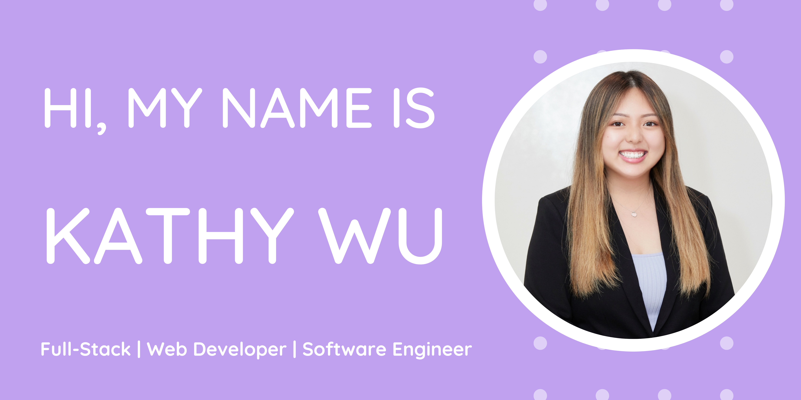

### Hi there, I'm Kathy Wu 👋

- :smile: I am a creative and open-minded full-stack web developer who recently graduated from General Assembly's Software Engineering Immersive Bootcamp.

- :sparkles: I enjoy making fun and engaging web applications on both front-end and back-end.
  In terms of design, I am very versatile at making websites from a wide range of perspectives: ones that look modern and minimalistic, as well as others that incorporate bright and bold themes.

- :mailbox: Feel free to connect with me anytime: kathy.s.wu@hotmail.com

  
  

